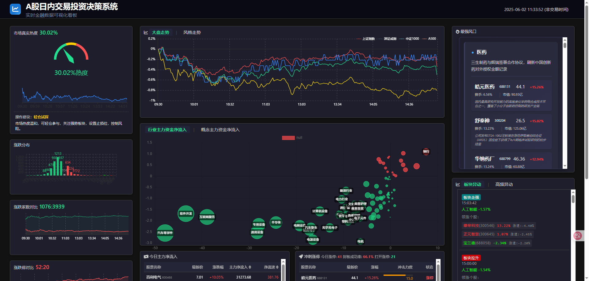

# Stock Dashboard v2


Real-time stock market monitoring dashboard providing trend analysis and investment decision support

## ✨ Core Features
- Real-time market index tracking
- Industry and concept fund flows
- Hot sector analysis  
- Market sentiment indicators
- Stock limit-up monitoring
- Real-time news updates

## 🚀 Getting Started

### Local Development
```bash
git clone https://github.com/PaxtonXia/stock_dashboard_v2.git
cd stock_dashboard_v2
npx serve
```
Open http://localhost:3000/main.html

### Docker Quick Start
```bash
docker run -d -p 3030:3030 stock-dashboard
```
Access http://localhost:3030

## 🐳 Docker Deployment

### Full Deployment Process
```bash
# 1. Clone repo
git clone https://github.com/PaxtonXia/stock_dashboard_v2.git
cd stock_dashboard_v2

# 2. Build image
docker build -t stock-dashboard .

# 3. Run container
docker run -d -p 3030:3030 --name stock-dashboard stock-dashboard
```

### Container Management
```bash
# Stop container
docker stop stock-dashboard

# Remove container 
docker rm stock-dashboard

# Remove image
docker rmi stock-dashboard

# View logs
docker logs -f stock-dashboard
```

### Troubleshooting
✅ Port conflict solution:
```bash
docker run -d -p 8080:3030 --name stock-dashboard stock-dashboard
```

## 📜 License
[MIT License](LICENSE)

## 🤝 Contributing
Welcome contributions! Please follow:
1. Fork the repo and create your branch
2. Commit changes with clear messages
3. Open a Pull Request

## 📞 Contact
**Author:**  
📧 Email: xiazuping@gmail.com  
📱 WeChat:  


## 📦 Electron Desktop Application

### Development & Run
1. Install Node.js and npm
2. Install dependencies:
   ```bash
   npm install
   ```
3. Start app:
   ```bash
   npm start
   ```

### Build & Package
1. Install electron-builder:
   ```bash
   npm install electron-builder --save-dev
   ```
2. Package app:
   ```bash
   npm run dist
   ```

### Configuration
```json
"build": {
  "appId": "com.example.stockdashboard",
  "win": {"target": "nsis"}
}
```

---

# 股票监控仪表盘 v2


实时股票行情监控系统，提供市场趋势分析与投资决策支持

## ✨ 核心功能
- 实时大盘指数追踪
- 行业资金流向监控
- 热点板块分析
- 市场情绪指标
- 涨停股票监控
- 实时新闻推送

## 🚀 快速开始

### 本地运行
```bash
git clone https://github.com/PaxtonXia/stock_dashboard_v2.git
cd stock_dashboard_v2
npx serve
```
访问 http://localhost:3000/main.html

### Docker快速启动
```bash
docker run -d -p 3030:3030 stock-dashboard
```
访问 http://localhost:3030

## 🐳 Docker部署

### 完整部署流程
```bash
# 1. 克隆仓库
git clone https://github.com/PaxtonXia/stock_dashboard_v2.git
cd stock_dashboard_v2

# 2. 构建镜像
docker build -t stock-dashboard .

# 3. 运行容器
docker run -d -p 3030:3030 --name stock-dashboard stock-dashboard
```

### 容器管理
```bash
# 停止容器
docker stop stock-dashboard

# 删除容器
docker rm stock-dashboard

# 删除镜像
docker rmi stock-dashboard

# 查看日志
docker logs -f stock-dashboard
```

### 常见问题
✅ 端口冲突解决方案：
```bash
docker run -d -p 8080:3030 --name stock-dashboard stock-dashboard
```

## 📜 开源协议
[MIT 许可证](LICENSE)

## 🤝 参与贡献
欢迎贡献代码！请遵循：
1. Fork仓库并创建特性分支
2. 提交清晰的commit信息
3. 发起Pull Request

## 📞 联系我们
**作者联系方式：**  
📧 邮箱: xiazuping@gmail.com  
📱 微信:  


## 📦 Electron桌面应用

### 开发运行
1. 安装Node.js和npm
2. 安装依赖：
   ```bash
   npm install
   ```
3. 启动应用：
   ```bash
   npm start
   ```

### 应用打包
1. 安装electron-builder：
   ```bash
   npm install electron-builder --save-dev
   ```
2. 构建安装包：
   ```bash
   npm run dist
   ```

### 配置说明
```json
"build": {
  "appId": "com.example.stockdashboard",
  "win": {"target": "nsis"}
}
